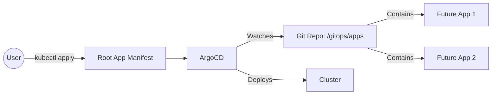

# Milestone 2 — Configure GitOps (Root App)

## Outcome
- **Access:** Argo CD UI accessible via local port-forwarding.
- **GitOps Pattern:** A "Root Application" (App-of-Apps) is configured to watch this repository.
- **Sync:** Argo CD is actively monitoring `gitops/apps` for new workloads.

## The Concept: "App of Apps"
Instead of manually creating applications in the UI, we create one **"Root App"** that points to a specific folder (`gitops/apps`) in our repository. Any YAML file added to that folder is automatically detected and deployed by Argo CD.



## Prerequisites
- **Milestone 1 Complete:** EKS Cluster is running and Terraform has finished applying.
- **CLI Access:** `kubectl` is configured (`aws eks update-kubeconfig ...`).
- **Repository:** Your code (including the gitops/apps folder) is pushed to your remote Git repository.

## Quick Steps

### 1. Verify Argo CD Installation
Since we installed Argo CD via Terraform in Milestone 1, we just need to confirm it is running.

```bash
kubectl get pods -n argocd
# Expected: All pods (server, repo-server, application-controller, dex) should be 'Running'.
```

### 2. Access the UI (Port Forwarding)

To avoid Load Balancer costs (~$15/mo), we access the UI securely via localhost.
```bash
# Run this in a separate terminal window. Keep it open.
kubectl -n argocd port-forward svc/argocd-server 8081:443
```
URL: https://localhost:8080
Warning: You will see a TLS/SSL warning (Self-signed cert). It is safe to click "Proceed".

### 3. Login
Retrieve the initial admin password generated by the Helm chart.
```bash
# Get the password
kubectl -n argocd get secret argocd-initial-admin-secret \
  -o jsonpath="{.data.password}" | base64 -d; echo
```
- Username: admin
- Password: (Output from command above)

### 4. Configure the Root Application
This is the "One App to Rule Them All." It tells Argo CD to look specifically at the `gitops/apps` folder in your repository.

Create gitops/root-app.yaml: (IMPORTANT: Replace https://github.com/YOUR_USERNAME/... with your actual repository URL)